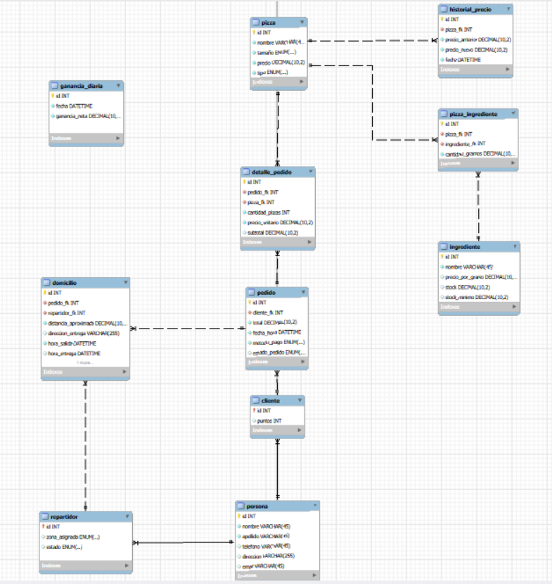

# Sistema de Gestión de Pedidos y Domicilios — Pizzería Don Piccolo
 
Proyecto educativo de base de datos relacional en MySQL, desarrollado para la Pizzería Don Piccolo con el objetivo de digitalizar y automatizar la gestión de clientes, pizzas, ingredientes, pedidos, repartidores, domicilios y pagos.
 
---
 
## Descripción
Este proyecto diseña y desarrolla una base de datos relacional que permite gestionar la información completa del proceso de venta de pizzas y domicilios, desde el registro del pedido hasta su entrega y pago, incorporando funciones, procedimientos almacenados, triggers, vistas y un evento programado para automatizar y optimizar las operaciones del negocio.
 
---
 
## Modelo Entidad-Relación (MER)

 
---
 
## Funcionalidades
 
### Gestión de Clientes
Registro de información de clientes e identificación de clientes frecuentes.
 
### Gestión de Pizzas
Registro de las pizzas disponibles con su nombre, tamaño, precio y tipO. Cada pizza tiene una receta asociada que define qué ingredientes utiliza y en qué cantidad, lo que permite calcular su precio automáticamente y controlar la disponibilidad de cada ingrediente según su stock.
 
### Gestión de Pedidos
Registro de pedidos indicando el cliente, la fecha y hora, las pizzas solicitadas, el método de pago y el estado del pedido. El total del pedido se calcula de forma automática, sumando el valor de las pizzas, el costo de envío y el impuesto correspondiente.
 
### Gestión de Repartidores
Registro de repartidores con su nombre, zona asignada y estado de disponibilidad. El sistema actualiza automáticamente ese estado según el avance de las entregas que tienen asignadas.
 
### Gestión de Domicilios
Registro de la hora de salida, hora de entrega, distancia aproximada y costo de envío de cada domicilio, asociado siempre a un pedido.
 
### Reporte de ganancias
Un evento programado calcula y almacena diariamente la ganancia neta del negocio, sin necesidad de intervención manual.
 
---
 
## Estructura de tablas
   
- **persona**: datos base compartidos entre clientes y repartidores.
- **cliente**: extiende a persona, agregando información de puntos.
- **repartidor**: extiende a persona, agregando zona asignada y disponibilidad.
- **pizza**: catálogo de pizzas, con nombre, tamaño, precio y tipo.
- **ingrediente**: catálogo de ingredientes, con precio por gramo, stock actual y stock mínimo permitido.
- **pizza_ingrediente**: receta de cada pizza; relaciona pizzas con sus ingredientes y la cantidad en gramos que utiliza cada una.
- **pedido**: encabezado del pedido, con cliente, fecha, total, estado y método de pago.
- **detalle_pedido**: líneas de cada pedido, con la pizza solicitada, la cantidad, el precio unitario y el subtotal.
- **domicilio**: datos de entrega asociados a un pedido.
- **historial_precio**: auditoría de los cambios en el precio de las pizzas.
- **ganancia_diaria**: registro histórico de la ganancia neta calculada cada día por el evento programado.
---
 
## Funciones y procedimientos almacenados
 
- **calcular_total_pedido**: calcula el total de un pedido, sumando el valor de las pizzas solicitadas, el costo de envío y el impuesto correspondiente.
- **ganancia_neta_diaria**: calcula la ganancia neta obtenida en una fecha específica, considerando la utilidad de las pizzas vendidas y la parte del cobro de envío que retiene el negocio.
- **actualizar_total_pedido**: procedimiento que recalcula y actualiza el total de un pedido, apoyándose en la función de cálculo de total.
- **actualizar_estado_pedido**: procedimiento que registra la hora de entrega de un domicilio y cambia el estado del pedido correspondiente a "entregado".
---
 
## Triggers
 
- **verificar_stock**: valida, antes de registrar una línea de pedido, que exista suficiente stock de todos los ingredientes necesarios para preparar la pizza solicitada.
- **restar_stock**: descuenta automáticamente, tras registrar una línea de pedido, el stock de los ingredientes utilizados.
- **calcular_precio_pizza**: calcula automáticamente el precio de una pizza al registrarse su receta, tomando en cuenta el costo de los ingredientes, la mano de obra y la utilidad fija.
- **copia_precio_unitario**: copia el precio vigente de la pizza hacia el detalle del pedido en el momento en que se realiza la compra.
- **actualizar_total_desde_detalle**: recalcula el total del pedido cada vez que se agrega una línea de pedido.
- **actualizar_total_desde_domicilio**: recalcula el total del pedido cada vez que se registra su domicilio.
- **auditoria_historial_precios**: registra en el historial cada cambio real en el precio de una pizza ya existente.
- **actualizar_disponiblidad_repartidor**: marca a un repartidor como disponible nuevamente una vez que se registra la hora de entrega de su domicilio.
---
 
## Evento programado
 
- **registrar_ganancia_neta**: evento que se ejecuta una vez al día y calcula automáticamente la ganancia neta del día, guardando el resultado en la tabla de ganancia diaria.
---
 
## Consultas SQL
 
Se desarrollaron consultas que resuelven los siguientes casos de negocio:
 
- Clientes que realizaron pedidos dentro de un rango de fechas determinado.
- Las pizzas más vendidas del catálogo, según la cantidad total de unidades pedidas.
- La cantidad de pedidos gestionados por cada repartidor.
- El tiempo promedio de entrega de los domicilios, agrupado por zona.
- Los clientes cuyo total gastado supera un monto determinado.
- Búsqueda de pizzas por coincidencia parcial de nombre.
- Identificación de clientes frecuentes, entendidos como aquellos con más de 5 pedidos en un mismo mes, mediante una subconsulta.
---
 
## Vistas
 
- **resumen_pedidos_cliente**: muestra, por cada cliente, la cantidad de pedidos realizados y el total gastado.
- **desempeño_repartidor**: muestra, por cada repartidor, el número de entregas completadas, el tiempo promedio de entrega y la zona asignada.
- **stock_bajo**: muestra los ingredientes cuyo stock actual se encuentra por debajo del mínimo permitido.
---
 
## Tecnología utilizada
 
- Motor de base de datos: MySQL 8.
- Herramienta de modelado: MySQL Workbench, para el diagrama Entidad-Relación y la generación de tablas mediante Forward Engineering.
- Lenguaje: SQL, incluyendo definición de datos, funciones, procedimientos almacenados, triggers, vistas y un evento programado.
---
 

 
## Autoría
 
Proyecto desarrollado por Valentina Rincon.